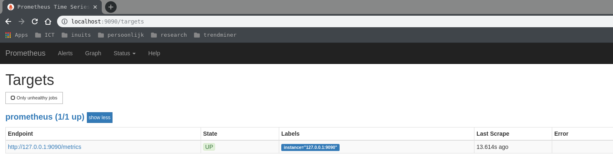
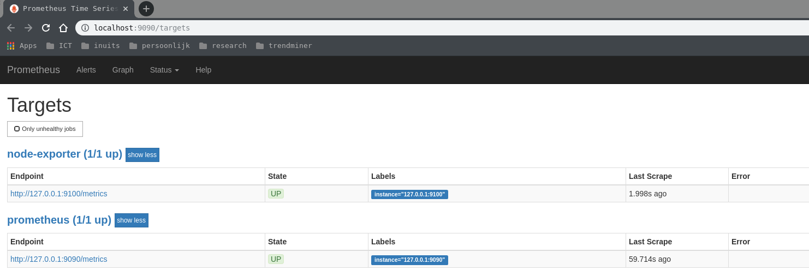
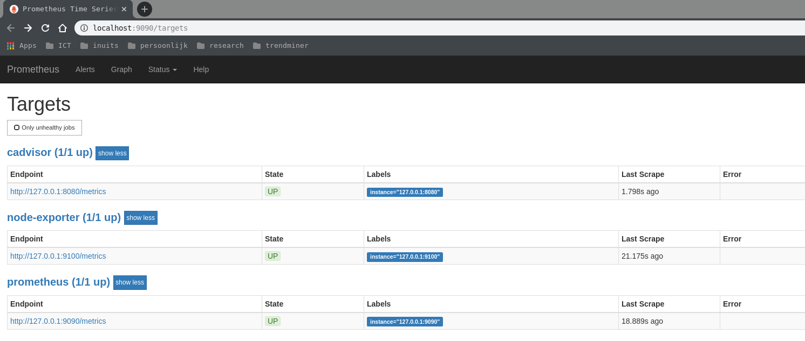
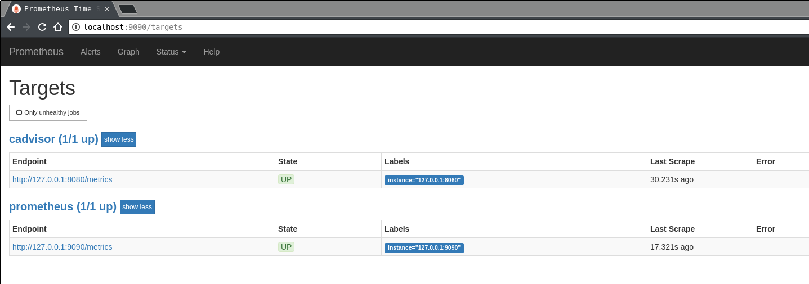

# Nomad consul prometheus

The aim of this project is to provide a development environment to show the dynamic configuration of [prometheus](https://prometheus.io) based on [consul](https://www.consul.io/).

By using [nomad](https://www.nomadproject.io) to start and stop our services they are all registered into a central key value store with a specific tag we configured.

Prometheus will use the key value store to collect the services with the 'metrics' tag to identify as an endpoint automatically.

The following steps should make that clear;

bring up the environment by using [vagrant](https://www.vagrantup.com) which will bring up a centos 7 virtualbox machine or lxc container. It will use the intialize.sh bash script to install both nomad and consul and also start a nomad job for our prometheus instance.

```bash
    $ vagrant up --provider lxc
    OR
    $ vagrant up --provider virtualbox
```

Once it is finished, you should be able to SSH in and interact with Nomad:

```bash
    $ vagrant ssh
    [vagrant@nomad ~]$ nomad status
    ID          Type     Priority  Status   Submit Date
    prometheus  service  50        running  2018-06-04T20:12:19Z
```

When you browse now to [http://localhost:9090/targets](http://localhost:9090/targets) you should be able to see the prometheus target configuration



By starting a nomad job for one of the two exporters available as a nomad job you should see that it comes up in the target configuration after a few moments.

```bash
[vagrant@nomad ~]$ nomad run /opt/nomad/node-exporter.hcl
==> Monitoring evaluation "310cc1b6"
    Evaluation triggered by job "node-exporter"
    Allocation "4cf3aff6" created: node "a52cf97d", group "app"
    Evaluation status changed: "pending" -> "complete"
==> Evaluation "310cc1b6" finished with status "complete"


[vagrant@nomad ~]$ nomad status node-exporter
ID            = node-exporter
Name          = node-exporter
Submit Date   = 2018-06-04T20:24:13Z
Type          = service
Priority      = 50
Datacenters   = dc1
Status        = running
Periodic      = false
Parameterized = false

Summary
Task Group  Queued  Starting  Running  Failed  Complete  Lost
app         0       0         1        0       0         0

Allocations
ID        Node ID   Task Group  Version  Desired  Status   Created  Modified
4cf3aff6  a52cf97d  app         0        run      running  29s ago  8s ago


[vagrant@nomad ~]$ nomad alloc-status 4cf3aff6
ID                  = 4cf3aff6
Eval ID             = 310cc1b6
Name                = node-exporter.app[0]
Node ID             = a52cf97d
Job ID              = node-exporter
Job Version         = 0
Client Status       = running
Client Description  = <none>
Desired Status      = run
Desired Description = <none>
Created             = 52s ago
Modified            = 14s ago

Task "node-exporter" is "running"
Task Resources
CPU       Memory           Disk     IOPS  Addresses
0/50 MHz  4.4 MiB/100 MiB  300 MiB  0     http: 127.0.0.1:9100

Task Events:
Started At     = 2018-06-04T20:24:34Z
Finished At    = N/A
Total Restarts = 0
Last Restart   = N/A

Recent Events:
Time                  Type        Description
2018-06-04T20:24:34Z  Started     Task started by client
2018-06-04T20:24:13Z  Driver      Downloading image prom/node-exporter:v0.16.0
2018-06-04T20:24:13Z  Task Setup  Building Task Directory
2018-06-04T20:24:13Z  Received    Task received by client
```

If you are too fast it will be showing as unknown when refreshing a few times it should come up as UP



a second exporter can be started for example [cadvisor](https://github.com/google/cadvisor)

```bash
[vagrant@nomad ~]$ nomad run /opt/nomad/cadvisor.hcl
==> Monitoring evaluation "d65d4fa8"
    Evaluation triggered by job "cadvisor"
    Allocation "f43d6b44" created: node "a52cf97d", group "app"
    Evaluation status changed: "pending" -> "complete"
==> Evaluation "d65d4fa8" finished with status "complete"
```



When we now stop the node-exporter it should automatically be removed from the target configuration:

```bash
[vagrant@nomad ~]$ nomad stop -purge node-exporter
==> Monitoring evaluation "7f683028"
    Evaluation triggered by job "node-exporter"
    Evaluation status changed: "pending" -> "complete"
==> Evaluation "7f683028" finished with status "complete"
```


